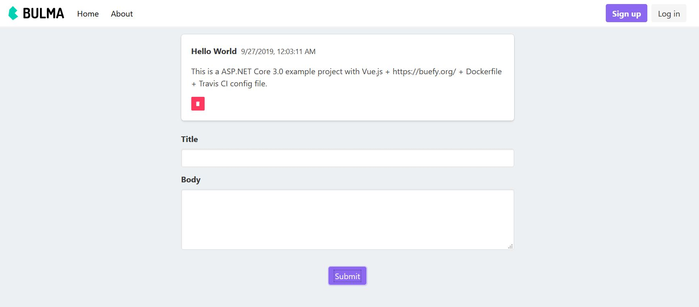

# .Net Core 3.0 VueJs Example Project

[](https://travis-ci.com/matusnovak/aspnet-core-vuejs-example)

This is an example project of .NET Core 3.0 with Vue.js and integration tests. This project was mainly inspired by the [Integration tests in ASP.NET Core - Microsoft docs](https://docs.microsoft.com/en-us/aspnet/core/test/integration-tests?view=aspnetcore-3.0).

**Why another example project?** There are plenty similar example projects for Vue.js and .NET Core. But, they usually either have only Vue.js or integration tests, never both. I could not find a working example for .NET Core 3.0 that has proper setup for Vue.js **and** integration tests as well. So, I have made one. Moreover, I did not find the idea of putting together both the API and Vue.js files into a single folder, it makes things messy. So I have decided to split it into two separate C# projects, and I think you will like it.



*The screenshot has a [Sign up] and [Log in] button, but they are purely decorative. Authentication has not been set up in this project.*

## Features

* A simple "Todo" app
* NET Core 3.0
* NET Core integration tests
* Async/await
* Vue.js 2 + router + [Buefy](https://buefy.org/) (which can be easily removed, only here as an example)
* Backend API and frontend Vue is properly split in two C# projects
* Comes with Dockerfile
* Travis CI ready
* In memory database already preconfigured
* **Pre-made repository and entity interfaces** - Go and see `src/Example.Api/Data` folder.

## Does not have

* Authentication
* MVC
* Razor views
* Webpack shenanigans

## Project structure

This example comes with the three C# projects:

* **src/Example** - This is the hearth of the application, contains Vue.js files, but not the REST api related things.
* **src/Example.Api** - Used by the main project, contains Data, Models, Controllers, etc.
* **tests/Example.IntegrationTests** - As the name says, the integration tests.

Detailed folder structure:

* **src/**
    * **Example/**                            - *The project that run the server*
        * **Client/**                         - *Vue.js project files*
        * **Program.cs**                      - *You know what this is!*
        * **Startup.cs**                      - *You also know what this is!*
    * **Example.Api/**                        - *The API part of this project separated from the Vue.js side*
        * **Controllers/**
            * **TodoController.cs**           - *Controller for "Todo.cs"
        * **Data/**                           - *All of the database related * stuff*
            * **ApplicationDbContext.cs**     - *All apps need DbContext*
            * **IEntity.cs**                  - *Base class for all models*
            * **IRepository.cs**              - *A base repository interface*
            * **Repository.cs**               - *A base repository class with common methods such as FindAll, FindBy, Create, etc.*
            * **TodoRepository.cs**           - *Repository for "Todo.cs"*
        * **Models/**                         - *Location of all models*
            * **Todo.cs**                     - *Sample model drived from * IEntity*

        * **Example.Api.csproj**              - *Project descriptor*
* **test/**
    * **Example.IntegrationTests/**           - *A project dedicated for integration tests*
        * **Controllers/** 
            * **TodoControllerTests.cs**      - *A sample test*

        * **ApplicationTestFactory.cs**       - *Tests configuration*
        * **Example.IntegrationTests.csproj** - *Project descriptor*

## Building 

This will automatically run `npm install` and `npm build` for the frontend.

```
dotnet publish "Example.csproj" -c Release -o /some/path
```

## Development

First, you will need to install NPM dependencies. To do that, go to the `Example` project folder, then install.

```
cd src/Example
npm install
```

To run build the frontend, run `npm run build`. But for development purposes, it is much better to run it in a watch mode. It will continue building until you press `Ctrl+C` and will update the frontend dist files (if any .Vue or .js file has changed) very quickly.

```
cd src/Example
npm run watch
```

To run the backend, open it through an IDE or just run:

```
cd src/Example
dotnet run
```

## Other resources

Other resources that may interest you related to this example project:

* [Integration testing - docs.microsoft.com](https://docs.microsoft.com/en-us/aspnet/core/test/integration-tests?view=aspnetcore-3.0)
* [Generic repository pattern in .NET Core - medium.com](https://medium.com/@marekzyla95/generic-repository-pattern-implemented-in-net-core-with-ef-core-c7e088c9c58)
* [Buefy Vue.js framework expo - buefy.org](https://buefy.org/expo)

## Contribution

Feel free to submit a pull request

## Contact

See my email in my profile on GitHub.

## License

```
MIT License

Copyright (c) 2019 Matus Novak

Permission is hereby granted, free of charge, to any person obtaining a copy
of this software and associated documentation files (the "Software"), to deal
in the Software without restriction, including without limitation the rights
to use, copy, modify, merge, publish, distribute, sublicense, and/or sell
copies of the Software, and to permit persons to whom the Software is
furnished to do so, subject to the following conditions:

The above copyright notice and this permission notice shall be included in all
copies or substantial portions of the Software.

THE SOFTWARE IS PROVIDED "AS IS", WITHOUT WARRANTY OF ANY KIND, EXPRESS OR
IMPLIED, INCLUDING BUT NOT LIMITED TO THE WARRANTIES OF MERCHANTABILITY,
FITNESS FOR A PARTICULAR PURPOSE AND NONINFRINGEMENT. IN NO EVENT SHALL THE
AUTHORS OR COPYRIGHT HOLDERS BE LIABLE FOR ANY CLAIM, DAMAGES OR OTHER
LIABILITY, WHETHER IN AN ACTION OF CONTRACT, TORT OR OTHERWISE, ARISING FROM,
OUT OF OR IN CONNECTION WITH THE SOFTWARE OR THE USE OR OTHER DEALINGS IN THE
SOFTWARE.
```
